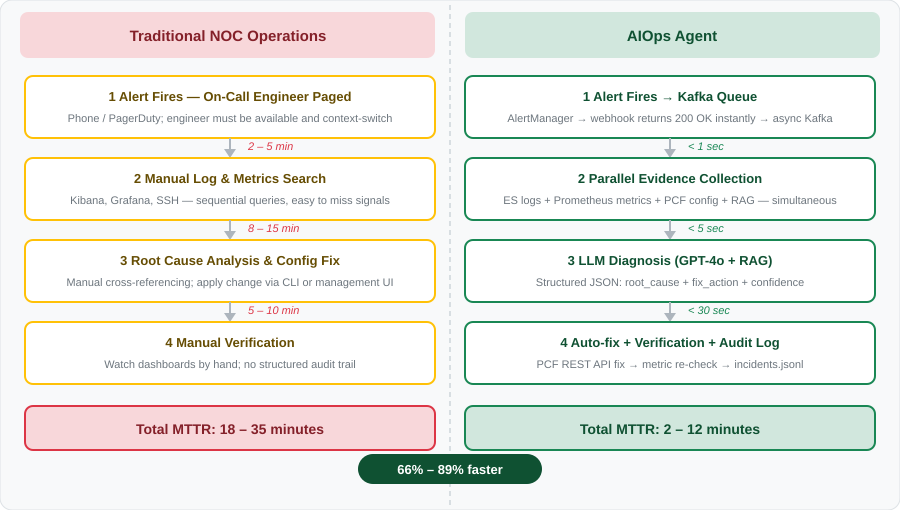
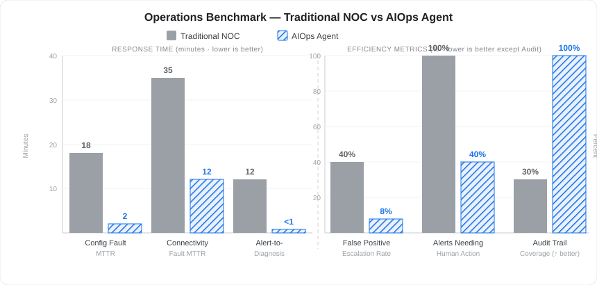

# AIOps Agent — 5G NF Intelligent Operations

> An autonomous AIOps agent that monitors 5G core network NF registration failures, localizes root causes, applies configuration fixes, and verifies recovery — end-to-end in minutes.

**Stack:** LangGraph · qwen-max (function calling) / OCI Generative AI · Alibaba Bailian RAG / OCI OpenSearch RAG · Kafka · Redis · Kubernetes · Prometheus · Elasticsearch

---

## Background

Modern 5G core networks generate thousands of alerts per day across dozens of network functions. Traditional NOC operations rely on manual triage — engineers read logs, cross-reference metrics, and apply fixes by hand. This process is slow, error-prone, and does not scale as network complexity grows.

This agent was built to augment NOC operations for a 5G core network deployment. It addresses three pain points:

- **Reactive to proactive**: correlates Prometheus metrics + Elasticsearch logs + NF config state to diagnose faults before they impact subscribers
- **Human-in-the-loop where it matters**: auto-fixes high-confidence, bounded faults (config errors, field typos, PLMN mismatches); escalates ambiguous or out-of-scope faults to on-call engineers with a structured diagnosis
- **Predictive analysis foundation**: the same pipeline — alert → evidence collection → LLM reasoning → action — can be extended to anomaly forecasting and capacity planning

---

## Operations Efficiency

### Workflow Comparison



### Performance Benchmark



**Alert triage breakdown (20-rule PCF ruleset):**

```
Auto-fix (no human needed)   ████████░░░░░░░░░░░░  35%   (7 / 20 alert types)
Assisted diagnosis + notify  ████████████░░░░░░░░  50%   (10 / 20 alert types)
Escalate immediately          ████░░░░░░░░░░░░░░░░  15%   (3 / 20 alert types)
```

---

## Architecture

```text
AlertManager ──► Kafka (aiops-alerts topic)
                     │
                     ▼
              aiops-worker (Kafka Consumer)
              ├── Redis dedup lock (SET NX EX 300)
              └── Semaphore(3) ── LangGraph Agent
                                      │
                     ┌────────────────┼─────────────────────┐
                     ▼                ▼                     ▼
               fetch_logs      fetch_metrics        fetch_nrf_logs
                     └────────────────┼─────────────────────┘
                                      ▼
                                  rag_lookup  ──► Vector Knowledge Base
                                      ▼
                                   analyze   ──► LLM (qwen-max, function calling)
                                      │            bind_tools → tool_calls
                                      ▼
                                   decide()  [deterministic routing on tool_call_name]
                          ┌──────────┴──────────────────┐
                          ▼                             ▼
                    execute_tool                      notify ──► Slack
                    ├── PLMN whitelist gate
                    ├── fixable_typos whitelist gate
                    └── pcf_update_plmn / pcf_fix_field
                          │
                          ▼
                      verify_fix  (Prometheus rate / field key check)
                          │
                          ▼
                    incidents.jsonl  (audit log)
```

**Webhook flow:** AlertManager → `aiops-webhook` (FastAPI, Kafka producer) → returns 200 immediately → Kafka consumer handles async

**Safety design:** Two independent whitelists in `execute_tool` enforce boundaries regardless of LLM output — PLMN whitelist for `update_pcf_plmn`, `fixable_typos` whitelist for `fix_profile_field`. Unauthorized calls are rejected and escalated to Slack.

---

## Fault Scenarios

The agent covers the full PCF alert ruleset. Actions fall into three tiers:

- **Auto-fix** — agent applies the fix autonomously, verifies, and closes the incident
- **Assisted** — agent diagnoses root cause, correlates evidence across sources, notifies on-call with a structured report
- **Escalate** — agent detects the fault but scope is outside safe auto-fix boundary; pages immediately with context

| # | Scenario | Severity | Detection | Agent Action | MTTR |
| --- | --- | --- | --- | --- | --- |
| 1 | NF Registration — PLMN Mismatch | Critical | Prometheus retry rate > 3/2min | **Auto-fix**: correct `plmnList` via PCF REST API, verify retry rate drops | ~2 min |
| 2 | NF Registration — Silent Field Drop | Critical | NRF WARN logs in ES (field rejected) | **Auto-fix**: rename typo field via PCF REST API, confirm NRF accepts | ~30 sec |
| 3 | NF Registration — Unknown Field | Critical | NRF WARN logs in ES (unrecognized attr) | **Escalate**: Slack alert with field name; outside auto-fix whitelist | immediate |
| 4 | Policy Control Service Down | Critical | Service health metric = 0 | **Assisted**: identify crashed pod, correlate with OOM/crash logs, recommend restart sequence | ~3 min |
| 5 | Session Management High Error Rate | Critical | SM ingress error rate > 10% (24h) | **Assisted**: cross-correlate with UDR/CHF errors to isolate root NF, structured Slack report | ~5 min |
| 6 | Session Management Traffic Overload | Major | SM request rate > 90% max MPS | **Assisted**: confirm burst pattern, recommend HPA scale-out, notify capacity team | ~2 min |
| 7 | Diameter Connector High Error Rate | Critical | Diameter ingress error rate > 10% | **Assisted**: check SCP peer health, correlate Diameter + SCP alerts, escalate with correlation summary | ~4 min |
| 8 | Diameter Connector Traffic Saturation | Major | Diameter request rate > 90% max MPS | **Assisted**: traffic surge detected, identify source NF, recommend load balancing review | ~2 min |
| 9 | UDR Connectivity Timeout Spike | Major | UDR timeout rate > 10% of requests | **Assisted**: query ES for timeout patterns and duration trends, suggest connection pool or retry tuning | ~5 min |
| 10 | UDR Service High Error Rate | Critical | UDR egress error rate > 10% (24h) | **Assisted**: correlate with DB tier health, determine whether UDR or underlying DB is root cause | ~5 min |
| 11 | CHF Connectivity Timeout Spike | Major | CHF timeout rate > 10% of requests | **Assisted**: analyze charging server response trends, notify billing ops with pattern data | ~5 min |
| 12 | CHF Service High Error Rate | Critical | CHF egress error rate > 10% (24h) | **Assisted**: spending limit control failure analysis, notify billing team with impact estimate | ~4 min |
| 13 | Policy Datastore High Error Rate | Critical | PolicyDS ingress error rate > 10% | **Assisted**: correlate with DB tier alert, determine if DB or policy engine is source | ~5 min |
| 14 | Policy Database Tier Unreachable | Critical | DB health indicator = 0 | **Assisted**: ES log analysis for crash reason (OOM/disk/network), trigger restart runbook via notify | ~8 min |
| 15 | Pod CPU Congestion | Critical | Pod CPU congestion state = congested | **Auto-fix**: trigger HPA scale-out, mark congested pod, notify if congestion persists post-scale | ~2 min |
| 16 | Pod Memory Congestion | Critical | Pod memory congestion state = congested | **Assisted**: identify memory leak signature in logs, recommend pod restart or JVM tuning | ~3 min |
| 17 | Request Queue Congestion | Critical | Pending request queue state = congested | **Assisted**: identify bottleneck service, correlate with CPU/memory alerts, recommend scale path | ~4 min |
| 18 | Egress Peer Unreachable | Major | SCP peer health status ≠ 0 | **Assisted**: diagnose peer connectivity, identify if peer or network path is down, suggest failover | ~3 min |
| 19 | All Egress Peers in Peer-Set Down | Critical | Peer available count = 0 across peer-set | **Escalate**: total egress path failure, page on-call immediately with peer-set name and last-seen time | immediate |
| 20 | SMSC Connection Loss | Major | Active SMSC connection count = 0 for 10 min | **Assisted**: check SMSC logs for disconnect reason, attempt reconnect trigger, notify messaging ops | ~5 min |

---

## Tech Stack Decisions

| Component | Choice | Why |
|---|---|---|
| Agent framework | LangGraph | Explicit node graph + conditional edges; LLM controls diagnosis only, not routing |
| LLM | OpenAI GPT / OCI Generative AI (Llama 3) | OpenAI-compatible API; pluggable — swap endpoint via env var |
| RAG | OCI OpenSearch vector index / managed KB | Provides 3GPP field name context for silent-drop detection; swappable backend |
| Message queue | Kafka KRaft | Decouples AlertManager from agent; survives burst alerts; enables multi-consumer patterns |
| Dedup lock | Redis `SET NX EX 300` | Distributed across potential multi-pod deployments; prevents duplicate runs on same alert |
| Observability | Elasticsearch + Prometheus | PCF/NRF logs go to ES, metrics to Prometheus |
| Config fix | PCF REST API (3GPP SBA) | Direct NF control plane — no manual SSH, auditable, reversible |

---

## Prompt Engineering

Four-layer separation of concerns:

```text
SYSTEM_PROMPT   — role definition + tool catalog (4 tools, stable)
ANALYSIS_PROMPT — parameterized evidence template ({allowed_plmns}, {field_errors}, etc.)
RAG chunks      — 3GPP field knowledge (retrieved at runtime, not hardcoded)
decide()        — deterministic routing on tool_call_name in Python (not LLM)
```

**Function calling flow:** LLM receives tool schemas via `llm.bind_tools(TOOLS)` and responds with a structured `tool_calls` object — no string parsing. `execute_tool` dispatches on `tool_call_name` and enforces whitelists independently of LLM reasoning.

```text
LLM role  →  diagnosis + intent expression (tool_calls)
Code role →  routing (decide) + enforcement (execute_tool whitelists) + execution (PCF API)
```

---

## Repository Structure

```
aiops-agent/
├── agent/
│   ├── graph.py          # LangGraph nodes + edges + decide() routing
│   ├── prompts.py        # SYSTEM_PROMPT + ANALYSIS_PROMPT
│   ├── state.py          # TypedDict state definition
│   ├── worker.py         # Kafka consumer + Redis dedup + Semaphore
│   └── log_fmt.py        # Structured log formatter
├── tools/
│   ├── es_tool.py         # Elasticsearch log query
│   ├── prometheus_tool.py # Prometheus metrics query
│   ├── pcf_tool.py        # PCF config read/write (3GPP SBA REST)
│   ├── rag_tool.py        # RAG retrieval (OCI OpenSearch / Alibaba Bailian)
│   └── tool_registry.py   # LangChain @tool definitions + TOOLS (bind) + TOOL_MAP (dispatch)
├── webhook/
│   └── server.py         # FastAPI: AlertManager → Kafka producer
├── k8s/
│   ├── aiops/            # Agent microservice manifests
│   │   ├── configmap.yaml
│   │   ├── webhook.yaml  # Deployment + ClusterIP Service
│   │   └── worker.yaml   # Deployment
│   ├── kafka/            # Kafka KRaft StatefulSet
│   ├── redis/            # Redis Deployment
│   └── alertmanager/     # AlertmanagerConfig CR + PrometheusRule
├── Dockerfile
└── requirements.txt
```

---

## Quick Start

### Prerequisites

- Kubernetes cluster with `aiops` namespace
- Kafka + Redis deployed in `aiops` namespace (see `k8s/kafka/` and `k8s/redis/`)
- Prometheus + Elasticsearch + 5G NF accessible from cluster nodes

### 1. Configure secrets

```bash
# Copy and fill in your credentials (do NOT commit this file)
cp k8s/aiops/secret.yaml.example k8s/aiops/secret.yaml
kubectl apply -f k8s/aiops/secret.yaml
```

### 2. Deploy to K8s

```bash
kubectl apply -f k8s/aiops/configmap.yaml
kubectl apply -f k8s/aiops/webhook.yaml
kubectl apply -f k8s/aiops/worker.yaml

# AlertManager routing
kubectl apply -f k8s/alertmanager/aiops-webhook.yaml
```

### 3. Verify

```bash
kubectl get pods -n aiops
kubectl logs -n aiops deploy/aiops-webhook
kubectl logs -n aiops deploy/aiops-worker -f
```

### 4. Trigger a fault (demo)

```bash
curl -X POST http://<alertmanager-host>/api/v2/alerts \
  -H 'Content-Type: application/json' \
  -d '[{"labels":{"alertname":"NfRegistrationFailure","namespace":"<nf-namespace>","NfType":"PCF"},"status":"firing"}]'
```

---

## Cloud Migration Path

| Self-hosted | OCI | AWS |
|---|---|---|
| Kubernetes (Kubespray) | OKE | EKS |
| Elasticsearch | OCI OpenSearch | Amazon OpenSearch |
| RAG knowledge base | OCI Generative AI + OpenSearch vector | Bedrock Knowledge Bases |
| LLM (GPT / Llama) | OCI Generative AI Service | Amazon Bedrock |
| incidents.jsonl | OCI NoSQL Database | DynamoDB |
| FastAPI webhook | OCI API Gateway + Functions | API Gateway + Lambda |
| Slack notify | OCI Notifications | SNS |

---

## Key Engineering Trade-offs

**Why Kafka instead of direct webhook → agent?**  
Decouples ingestion from processing. AlertManager gets instant 200 response. Worker controls concurrency (Semaphore(3)) and deduplication (Redis). On restart, unprocessed offsets are re-consumed.

**Why Redis for dedup instead of in-memory set?**  
In-memory state is lost on pod restart. Redis survives worker restarts and works across multiple worker replicas.

**Why deterministic `decide()` instead of LLM routing?**  
LLM handles ambiguous log interpretation. Routing logic (PLMN whitelist check, confidence threshold, fix boundary) is code — testable, auditable, zero hallucination risk.

**Why separate webhook + worker pods?**  
Different resource profiles: webhook is lightweight (Kafka producer only), worker is CPU/memory intensive (LLM calls, concurrent threads). Scale independently.

---

## Deployment — `aiops` Namespace

```bash
dscl1@bastion:~$ kubectl get pods -n aiops 
NAME                            READY   STATUS    RESTARTS   AGE
aiops-webhook-869978964-klp7l   1/1     Running   0          9h
aiops-worker-7cd48b7c78-c72n6   1/1     Running   0          6s
aiops-worker-7cd48b7c78-mb2v9   1/1     Running   0          9h
aiops-worker-7cd48b7c78-mbbwk   1/1     Running   0          6s
aiops-worker-7cd48b7c78-rhvl9   1/1     Running   0          6s
aiops-worker-7cd48b7c78-z6prj   1/1     Running   0          6s
kafka-0                         1/1     Running   0          16h
redis-845d787d54-fdgtm          1/1     Running   0          17h

$ kubectl get svc -n aiops
NAME             TYPE        CLUSTER-IP      EXTERNAL-IP   PORT(S)           AGE
aiops-webhook    ClusterIP   10.233.61.70    <none>        8000/TCP          97m
kafka            NodePort    10.233.43.141   <none>        9092:30092/TCP    8h
kafka-headless   ClusterIP   None            <none>        9092/TCP,9093/TCP 8h
redis            NodePort    10.233.44.168   <none>        6379:30379/TCP    9h

$ kubectl get deployment -n aiops
NAME            READY   UP-TO-DATE   AVAILABLE   AGE
aiops-webhook   1/1     1            1           97m
aiops-worker    1/1     1            1           97m
redis           1/1     1            1           9h
```

---

## Sample Agent Runs

### Scenario 1 — PLMN Mismatch (auto-fix in ~2 min)

Alert fires → agent fetches evidence → LLM calls `update_pcf_plmn` via function calling → PLMN whitelist gate passes → PCF REST API fix → Prometheus rate verified.

```text
[ALERT]  NfRegistrationFailure | ns=occnp2 | NfType=PCF | status=firing
[AGENT]  Starting LangGraph agent for occnp2...

[GRAPH]  → fetch_logs      PCF ERROR/WARN logs retrieved from Elasticsearch
[GRAPH]  → fetch_metrics   nrf_retry_rate=10.7/2min  (threshold > 3)
[GRAPH]  → fetch_nrf_logs  no dropped fields detected
[GRAPH]  → rag_lookup      skipped — no dropped fields detected
[GRAPH]  → analyze         (mode=llm)

[LLM]    > POST /compatible-mode/v1/chat/completions  model=qwen-max
[LLM]    ┌── Evidence sent to LLM ─────────────────────────────────────
[LLM]    │  NRF retry rate: 10.7  [active failure loop > 10]
[LLM]    │  PCF plmnList: [{'mcc': '510', 'mnc': '088'}]
[LLM]    │  Allowed PLMNs: 510/011, 208/93, 001/01
[LLM]    │  Silent-drop field errors: none
[LLM]    │  PCF logs: WARN nrf-client: PLMN 510/088 not in allowed list
[LLM]    └────────────────────────────────────────────────────────────
[LLM]    < 200 OK  duration=5.1s
[LLM]    ── Observations ────────────────────────────────────
[LLM]    [1] NRF retry rate 10.7 confirms active registration failure loop.
[LLM]    [2] PCF plmnList 510/088 is not in the allowed PLMN list.
[LLM]    [3] No silent-drop field errors detected.
[LLM]    ── Diagnosis ───────────────────────────────────────
[LLM]    root_cause → PCF plmnList contains PLMN 510/088 not accepted by NRF.
[LLM]    confidence → high
[LLM]    tool_call  → update_pcf_plmn({'mcc': '510', 'mnc': '011'})
[LLM]    ────────────────────────────────────────────────────

[GRAPH]  → decide  route=execute_tool  tool=update_pcf_plmn  confidence=high
[GRAPH]  → execute_tool  tool=update_pcf_plmn  args={'mcc': '510', 'mnc': '011'}
[SAFETY] PLMN 510/011 ✓ confirmed in whitelist
[EXECUTE] > PUT /nrf-client-nfmanagement/nfProfileList
[EXECUTE] > plmnList=[{'mcc':'510','mnc':'011'}]  (was [{'mcc':'510','mnc':'088'}])
[PCF]    < 200 OK  duration=0.048s

[GRAPH]  → verify_fix  attempt 1/3  (sleeping 30s)
[VERIFY] nrf_retry_rate=6.3 >= 3  still recovering — retry
[GRAPH]  → verify_fix  attempt 2/3  (sleeping 60s)
[VERIFY] nrf_retry_rate=0.0 < 3  ✓ registration restored

[AGENT]  ===== Run Complete =====
[AGENT]  Root cause  : PCF plmnList contains PLMN 510/088 not accepted by NRF.
[AGENT]  Fix applied : True  |  Fix verified: True
[AUDIT]  Incident saved → /data/incidents.jsonl
```

---

### Scenario 2 — Silent-Drop Field Typo (auto-fix in ~5 sec)

NRF silently drops a misspelled field; PCF thinks registration succeeded (HTTP 200) but NF profile is incomplete. Agent detects via NRF WARN logs + RAG lookup, fixes via PCF REST API, verifies by checking profile keys.

```text
[ALERT]  NfRegistrationFailure | ns=occnp2 | NfType=PCF | status=firing
[AGENT]  Starting LangGraph agent for occnp2...

[GRAPH]  → fetch_metrics   nrf_retry_rate=0.0  (no hard rejection loop)
[GRAPH]  → fetch_nrf_logs  ⚠ fixable typo detected: 'nfSetIdLists'
[GRAPH]               WARN ocnrf [requesterNfType=PCF]: Allow only VendorSpecific
[GRAPH]               attributes — field 'nfSetIdLists' is not a valid 3GPP attribute
[GRAPH]  → rag_lookup  querying knowledge base for 'nfSetIdLists'
[RAG]    top chunk: "Per 3GPP TS 29.510 §6.2.2, correct field is 'nfSetIdList'
                    (no trailing 's'). NRF silently drops unrecognized attributes."
[GRAPH]  → analyze  (mode=llm)
[LLM]    < 200 OK  duration=4.2s
[LLM]    ── Diagnosis ───────────────────────────────────────
[LLM]    root_cause → Field 'nfSetIdLists' is a typo; NRF silently drops it.
[LLM]    confidence → high
[LLM]    tool_call  → fix_profile_field({'wrong_name': 'nfSetIdLists', 'correct_name': 'nfSetIdList'})
[LLM]    ────────────────────────────────────────────────────

[GRAPH]  → decide  route=execute_tool  tool=fix_profile_field  confidence=high
[GRAPH]  → execute_tool  tool=fix_profile_field
[SAFETY] Field 'nfSetIdLists' ✓ confirmed in fixable_typos whitelist
[EXECUTE] > PATCH /nrf-client-nfmanagement/nfProfileList
[EXECUTE] > rename 'nfSetIdLists' → 'nfSetIdList'
[PCF]    < 200 OK  duration=0.051s

[VERIFY] field key 'nfSetIdList' present ✓  |  'nfSetIdLists' absent ✓

[AGENT]  ===== Run Complete =====
[AGENT]  Root cause  : PCF field 'nfSetIdLists' silently dropped by NRF.
[AGENT]  Fix applied : True  |  Fix verified: True
[AUDIT]  Incident saved → /data/incidents.jsonl
```

---

### Scenario 3 — Unknown Field (safety gate blocks → Slack escalation)

Field name is not in the `fixable_typos` whitelist. Even if the LLM infers a correction using 3GPP training knowledge, `execute_tool` rejects the call at the code layer and escalates to Slack.

```text
[GRAPH]  → fetch_nrf_logs  ⚠ unknown dropped field: 'nfSetIdListxxx' (not in fixable_typos)
[GRAPH]  → rag_lookup  skipped — unknown fields ['nfSetIdListxxx'] — no RAG needed
[GRAPH]  → analyze  (mode=llm)
[LLM]    ── Diagnosis ───────────────────────────────────────
[LLM]    root_cause → Field 'nfSetIdListxxx' is causing NRF to silently drop it.
[LLM]    confidence → high
[LLM]    tool_call  → fix_profile_field({'wrong_name': 'nfSetIdListxxx', 'correct_name': 'nfSetIdList'})
[LLM]    ────────────────────────────────────────────────────

[GRAPH]  → decide  route=execute_tool  tool=fix_profile_field  confidence=high
[GRAPH]  → execute_tool  tool=fix_profile_field
[SAFETY] Field 'nfSetIdListxxx' not in fixable_typos whitelist — refusing.
[SAFETY] Approved: ['ipv4Address', 'nfServiceLists', 'nfSetIdLists', 'plmnLists']
[GRAPH]  → notify  (human escalation — no applicable auto-fix for this fault)
[ESCALATION] Alert: NfRegistrationFailure | ns=occnp2
[ESCALATION] Root cause: Field 'nfSetIdListxxx' dropped by NRF — not in approved fixable list
[ESCALATION] → Human operator intervention required
[NOTIFY] Slack notified  status=200
[AUDIT]  Incident saved → /data/incidents.jsonl
```


---

## Audit Log (`incidents.jsonl`)

Every agent run appends a structured record — full decision trail, queryable, maps to DynamoDB/OCI NoSQL in production.

```jsonl
{"ts":"2026-05-18T03:22:47","alert_name":"NfRegistrationFailure","namespace":"5gpcf","root_cause":"PCF plmnList contains invalid PLMN (510/088), not in NRF allowed list.","fix_action":"update_plmn:510:011","confidence":"high","fix_applied":true,"fix_verified":true,"error":null}
{"ts":"2026-05-18T04:09:22","alert_name":"NfRegistrationFailure","namespace":"5gpcf","root_cause":"Field 'nfSetIdLists' silently dropped by NRF — typo of 'nfSetIdList'.","fix_action":"fix_field:nfSetIdLists:nfSetIdList","confidence":"high","fix_applied":true,"fix_verified":true,"error":null}
{"ts":"2026-05-18T11:08:06","alert_name":"NfRegistrationFailure","namespace":"5gpcf","root_cause":"PCF plmnList contains invalid PLMN (510/089), not accepted by NRF.","fix_action":"update_plmn:510:011","confidence":"high","fix_applied":true,"fix_verified":true,"error":null}
{"ts":"2026-05-18T13:23:13","alert_name":"NfRegistrationFailure","namespace":"5gpcf","root_cause":"Field 'nfSetIdLists' incorrectly named, silently dropped by NRF.","fix_action":"fix_field:nfSetIdLists:nfSetIdList","confidence":"high","fix_applied":true,"fix_verified":true,"error":null}
```
